**Wiper** 是一个结合文档编辑与绘图功能的工具，旨在帮助用户逐步掌握全栈开发中的核心概念。通过这个项目实践，你将深入理解现代 Web 开发技术，从前端到后端，从数据管理到用户体验设计，全面提升你的开发能力，同时尽情释放你的创造力！无论是创作、协作还是学习新技能，Wiper 都为你提供了一个完整的平台，助力你实现想法。

## 声明

该项目代码全部开源，任何人都可以自由访问和使用。如果这个项目对你有所帮助或启发，请不要忘记给它一个 ⭐️ Star，这将是对我最大的鼓励与支持。你的关注和支持不仅能帮助项目不断进步，也能激励我继续分享更多优质的内容和工具。感谢你的支持，愿我们一起在学习和创作的道路上共同进步！

## 主要功能

- **登录注册**: 支持用户通过邮箱、社交账号（如 Google、GitHub 等）进行注册和登录，确保用户信息的安全性和隐私性。
- **应用路由/身份验证/页面保护**: 使用 Next.js 的内置路由系统和身份验证中间件，结合 JWT 或 OAuth2 等认证方式，实现页面的权限控制与用户会话管理，确保页面只能被授权用户访问。
- **配置 Convex 数据库**: 设置并集成 Convex 数据库，实现数据存储、查询和实时同步，简化数据的管理和业务逻辑处理，确保数据的持久化和一致性。
- **创建新团队/创建和添加新文件**: 提供用户创建和管理团队的功能，可以在团队中添加、编辑或删除成员。用户可以创建新文件，支持上传文件、文档或项目资料到团队空间，实现团队协作和文件共享。
- **构建仪表板**: 设计和实现一个直观的用户仪表板，用于展示团队和项目的概览、文件状态、实时更新和通知。仪表板可以根据用户权限动态显示内容，并提供快捷操作入口。
- **集成 Editor.js 文档编辑器和白板/画布功能**: 将 Editor.js 集成到应用中，为用户提供基于块级的文档编辑能力，支持多种内容格式。集成 Excalidraw 白板功能，用户可以在白板上进行手绘、流程图、脑图等可视化操作，增强创作体验。
- **控制免费版和付费版计划**: 设置应用的免费版和付费版功能差异，包括存储空间、团队成员数量、文件数量等限制，并支持订阅管理和支付功能，确保用户可以轻松升级到付费版享受更高的权限和功能。
- **部署应用及 Convex 数据库**: 将应用部署到云端（如 Vercel、AWS 等），配置域名、SSL 证书以及环境变量。确保 Convex 数据库与应用的无缝对接，实现数据的持续集成与更新。同时设置自动化部署流程，以便后续的更新与维护。

## 技术栈：

- **React**: 用于构建用户界面，提供组件化的开发体验。
- **Next.js**: 基于 React 的框架，用于服务端渲染、静态生成、API 路由管理等，提升性能和 SEO。
- **Tailwind CSS**: 实现高效的样式处理，提供实用类（utility-first）的 CSS 框架，简化样式定义。
- **shadcn**: 用于管理和自定义 UI 组件库，提供易于扩展的设计系统。
- **Lucide Icon**: 图标库，用于定制和使用开源图标，适用于多种风格。
- **Convex**: 后端服务，用于数据管理和实时同步，简化数据库操作与数据存储。
- **Editor.js**: 基于块级编辑器的富文本编辑器，提供可扩展的内容创建体验，适合文章、博客的编辑。
- **Excalidraw**: 开源白板工具，提供绘图和可视化编辑能力，适合手绘风格的图形和概念图。

## 项目源码

项目已在 GitHub 上开源，欢迎查看和贡献代码！你可以在以下链接找到项目源码：

GitHub: <https://github.com/geallenboy/wiper>

如果你觉得这个项目对你有帮助，别忘了给它一个 ⭐️ Star 哦！你的支持是我前进的动力！

## 学习交流

如果你对项目有任何想法、建议或疑问，欢迎随时交流讨论。我非常乐意与大家一起学习与成长，共同探索更好的技术实现方式。你可以通过微信联系我：**gegarron**。期待与你的沟通与碰撞出新的灵感！

## 项目展示

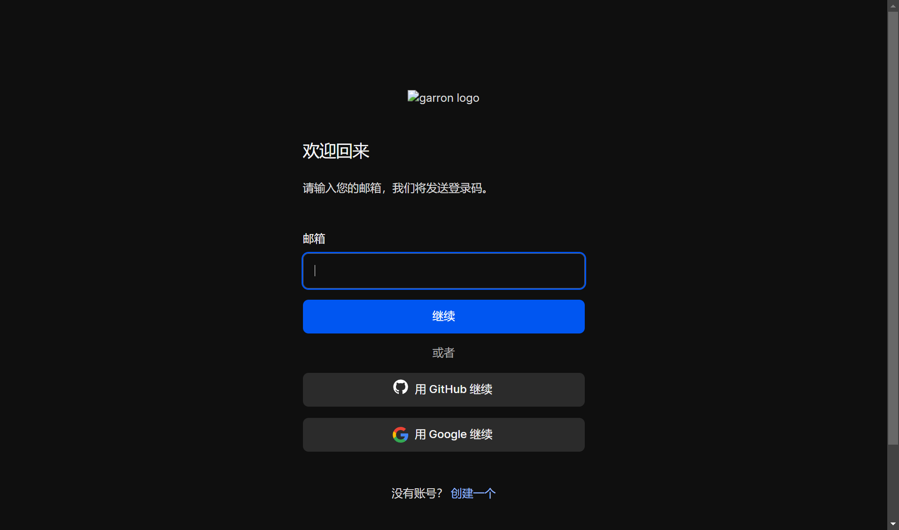
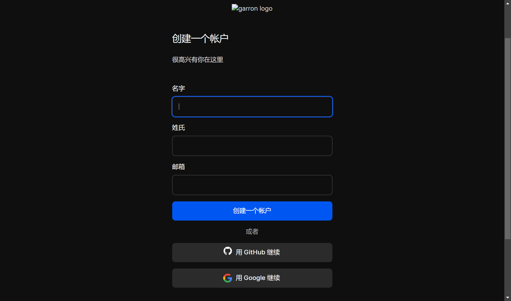
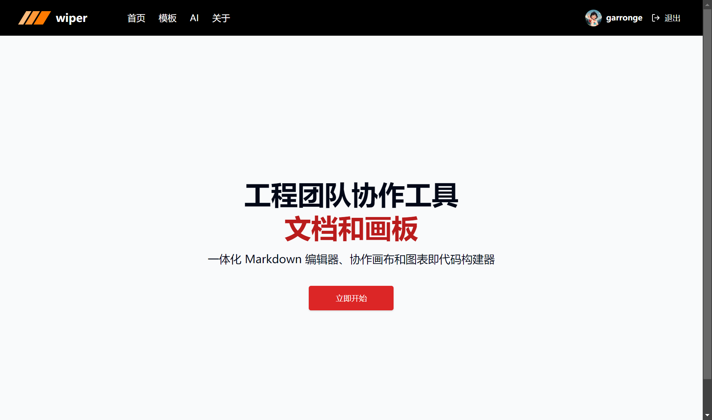
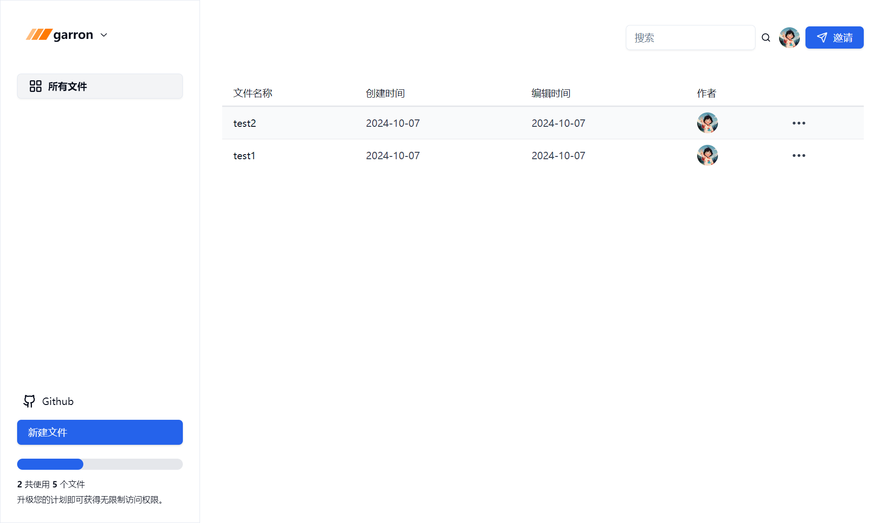
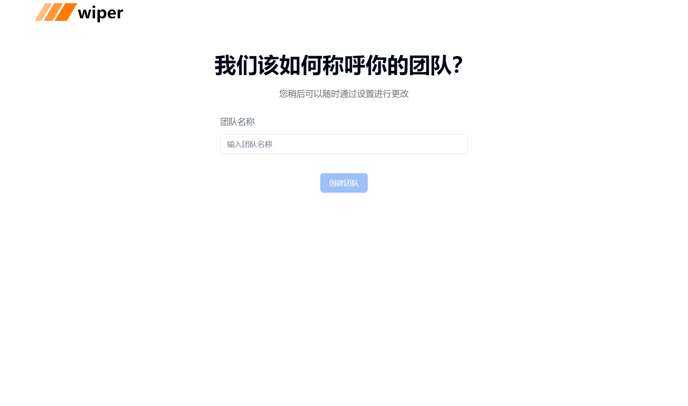
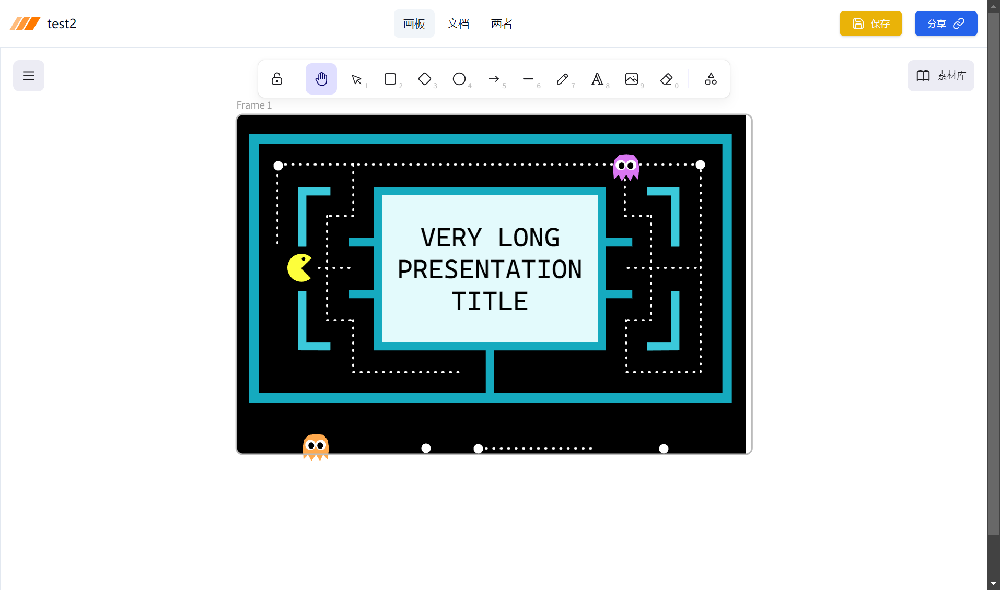
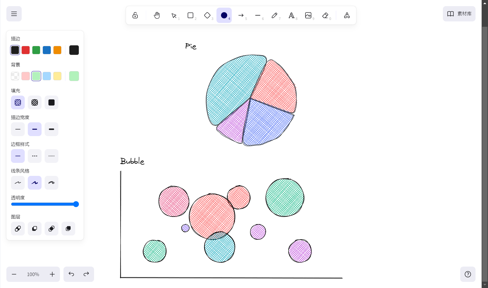
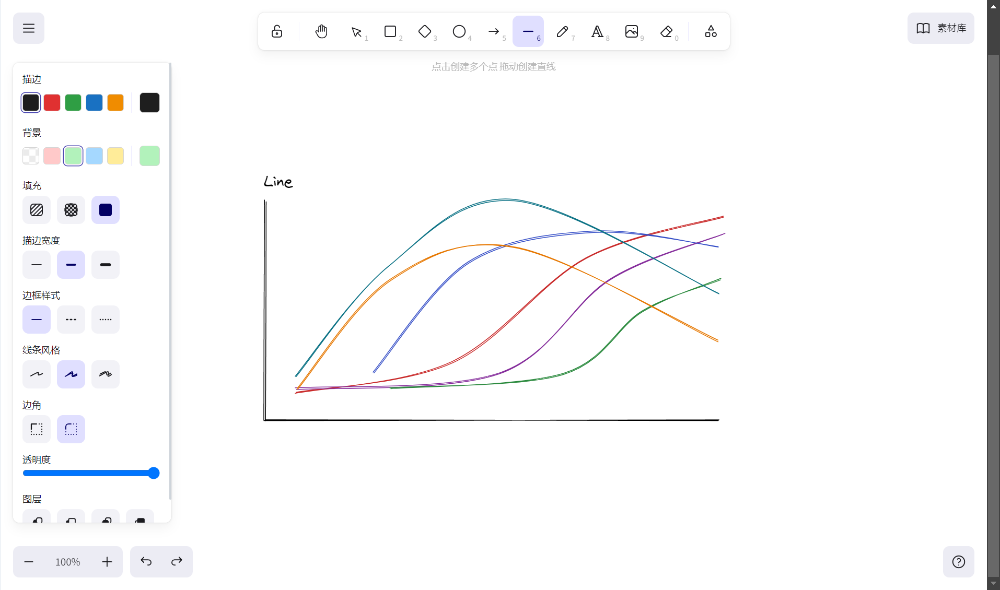
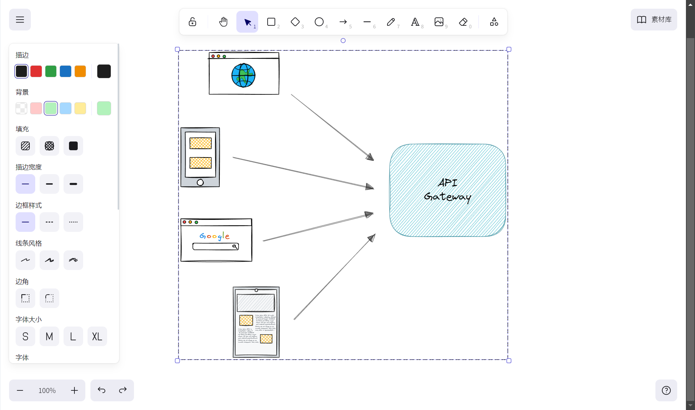
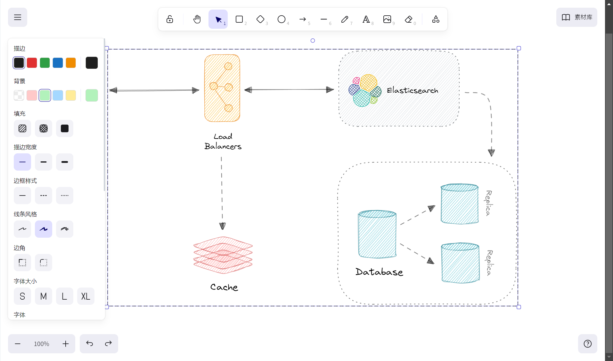
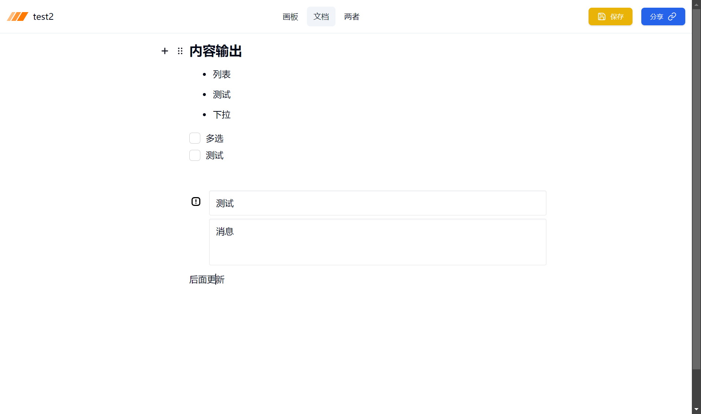
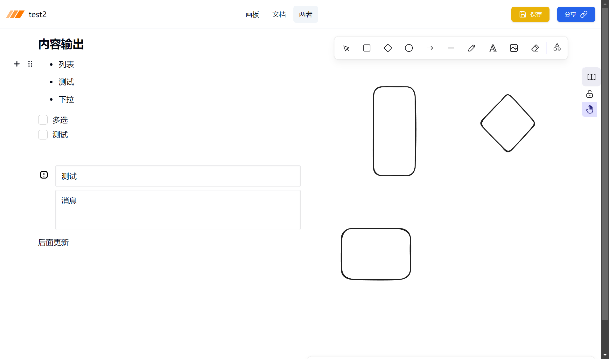
